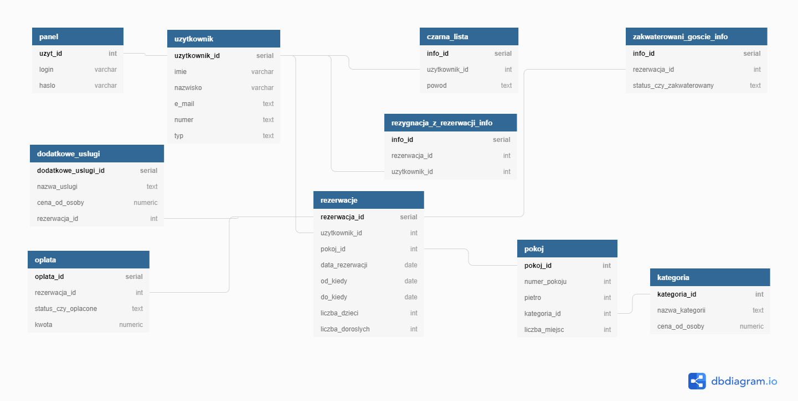

# Databases Project
Semester project for **Databases 1** course concerning usage of **SQL** language in *PostgreSQL* with *Java* usage.

The project focuses on database hotel services, which inlcudes implementations of:
* queries
* views
* functions
* triggers and trigger functions
* transactions

## Full documentation can be found [here](./DOC/Dokumentacja_Baza danych_Hotel.pdf)

## ERD diagram 
